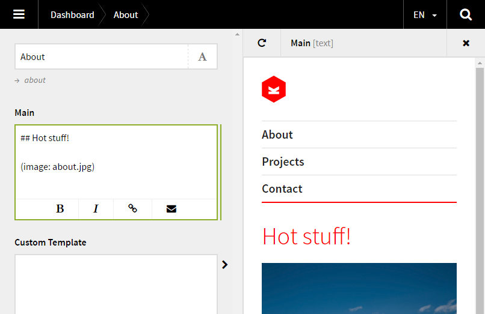

# Reveal

*Version 0.2 - BETA*

## In short

- Live preview with Ajax.
- See what you get before save.
- Use the current page or add a custom template.



### Supports

- Multi language.
- Structure field.
- Multiple instances.
- `kirbytext`.

## Install

### 1. Add the `reveal` folder in `/site/plugins/`.
### 2. Add the field to the blueprint

```
fields:
  my_field:
    label: Reveal
    type: reveal
    selector: body .main
```

#### Type

The `type` has to be `reveal`. It's an extended textarea field.

#### Selector

To know where the content should be placed in the preview, a [DOM selector](http://www.w3schools.com/cssref/css_selectors.asp) is needed.

### 3. Usage

Click the reveal textarea arrow to see the preview. Write something in the reveal textarea and watch the preview update live.

## Advanced

- [Preview](docs/PREVIEW.md)
- [Selector](docs/PREVIEW.md)
- [Template](docs/TEMPLATE.md)
- [Filter](docs/FILTER.md)

## Changelog

### 0.2 beta

- Fixed uri problem on multi language.
- Fixed language code problem on multi language.
- Fixed javascript collision issues.

### 0.1 beta

- Initial release

## Requirements

Kirby 2.3

## License

MIT