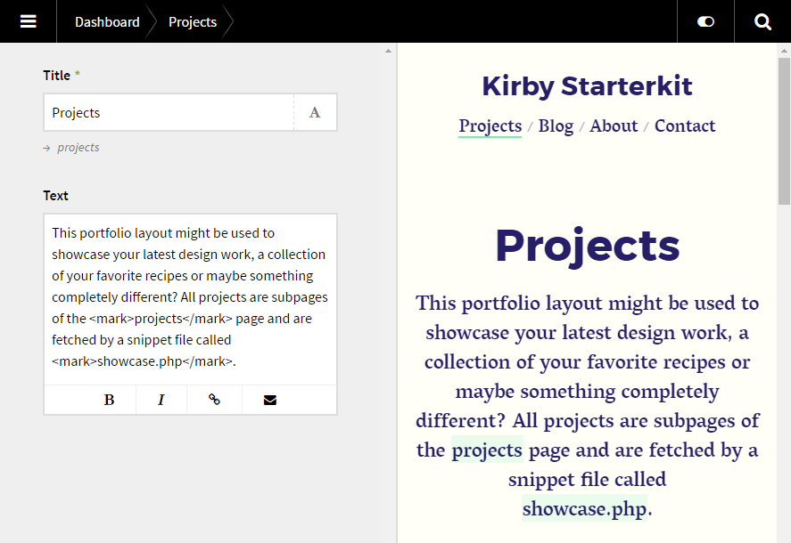

# Kirby Reveal

***Version 0.5 - [Changelog](docs/changelog.md)***

Splitscreen preview of the site in the panel.

- Live preview when writing.



### [Installation instructions](docs/install.md)

## Setup

### 1. Blueprint

To make it work as expected, add the following code to your blueprint:

```text
fields:
  reveal: reveal
```

## Usage

Click the switch button to the left of the search icon in the panel. It's an on/off toggle of the splitscreen preview.

### Read more about the **[core engine](docs/engine.md)**.

## Options

The following options can be set in your `/site/config/config.php` file:

```php
c::set('plugin.reveal.refresh', 2000);
```

If it's set to `0`, it will no longer autorefresh. It will only refresh on save.

### timeout

The iframe will never refresh more often than this time. It's set in miliseconds so `2000` is 2 seconds.

## Troubleshooting

Kirby Reveal will not take [page models](https://getkirby.com/docs/developer-guide/advanced/models) into account. If you are using a page model that replace your field value with another value, the preview will still generate this value without the model loaded for it.

Controllers, page methods etc. will work just fine. 

## Requirements

- [**Kirby**](https://getkirby.com/) 2.4+

## Disclaimer

This plugin is provided "as is" with no guarantee. Use it at your own risk and always test it yourself before using it in a production environment. If you find any issues, please [create a new issue](https://github.com/jenstornell/kirby-reveal/issues/new).

## License

[MIT](https://opensource.org/licenses/MIT)

It is discouraged to use this plugin in any project that promotes racism, sexism, homophobia, animal abuse, violence or any other form of hate speech.

## Credits

- [Jens Törnell](https://github.com/jenstornell)